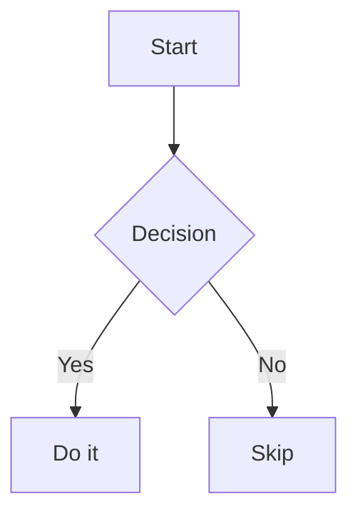

# planview

A local web viewer for MDX plan files. Browse, read, comment, and export your plans from the browser — no database, no cloud, everything stays on disk.

## Install & run

No cloning required. Use `npx`:

```bash
npx @vtripathi/planview --dir ./your-plans-directory
```

Then open [http://localhost:3000](http://localhost:3000).

### Options

```
--dir <path>    Directory containing .mdx plan files (default: current directory)
--port <port>   Port to listen on (default: 3000)
-h, --help      Show help
```

### Examples

```bash
# Plans are in a ./plans folder relative to where you run the command
npx @vtripathi/planview --dir ./plans

# Absolute path
npx @vtripathi/planview --dir /home/user/my-project/plans

# Different port
npx @vtripathi/planview --dir ./plans --port 4000
```

## Plans directory structure

Place `.mdx` files directly inside the directory you pass to `--dir`:

```
plans/
  my-feature.mdx
  another-plan.mdx
```

Each file can have optional frontmatter:

```mdx
---
title: My Feature Plan
---

# Content here
```

If no `title` is set in frontmatter, the first `# heading` is used. Comments are stored as `<slug>.comments.json` alongside the plan file, auto-created when you add the first comment.

## Features

| Feature | Description |
|---------|-------------|
| **Browse** | Home page lists all `.mdx` files in the directory |
| **Read** | Full MDX rendering with rich components, mermaid diagrams, and syntax highlighting |
| **Comment** | Click any `h2`/`h3` heading to add an inline note |
| **History** | Side drawer shows `git log` for each plan file |
| **Export** | "Export HTML" button — print or save as PDF from the browser |

## Supported MDX components

Planview ships with built-in components you can use in your `.mdx` files:

### Callout

```mdx
<Callout type="info" title="Note">
  Something worth highlighting.
</Callout>
```

Types: `info`, `warning`, `tip`, `danger`

### Tabs

```mdx
<Tabs labels={["Option A", "Option B"]}>
  <Tab>Content for Option A</Tab>
  <Tab>Content for Option B</Tab>
</Tabs>
```

### Steps

```mdx
<Steps>
  <Step title="Install dependencies">Run `npm install`</Step>
  <Step title="Configure">Set your environment variables</Step>
  <Step title="Run">Execute `npm start`</Step>
</Steps>
```

### Badge

```mdx
<Badge variant="success">Completed</Badge>
<Badge variant="warning">In Progress</Badge>
<Badge variant="error">Blocked</Badge>
<Badge variant="info">Review</Badge>
```

### CodeBlock

```mdx
<CodeBlock language="typescript" title="example.ts">
const greet = (name: string) => `Hello, ${name}`
</CodeBlock>
```

### Mermaid diagrams

Fenced code blocks tagged `mermaid` render as diagrams:

````mdx

````

### GFM task lists

```mdx
- [x] Done
- [ ] Not done
```

> **Note:** Narrow markdown tables (≤4 columns, short cells) render with full styling. Wide or semantic tables (model comparisons, step sequences) should use a component instead.

## Workflow with the visual-docs skill

planview pairs with the **[visual-docs](https://github.com/vtri950/visual-docs-skill)** Claude Code skill. The skill authors structured MDX documents; planview displays them.

1. Install the skill from [vtri950/visual-docs-skill](https://github.com/vtri950/visual-docs-skill) into your Claude Code setup
2. Run `/visual-docs <topic>` to author a new doc, or `/visual-docs convert <file.md>` to convert an existing one — output is a `.mdx` file saved to your docs directory
3. Run `npx @vtripathi/planview@latest --dir ./your-docs` to view it
4. Click headings to add notes, use the side drawer for git history
5. Export HTML to share or save as PDF

## Publishing / contributing

The package is published to npm at [`@vtripathi/planview`](https://www.npmjs.com/package/@vtripathi/planview).

To build and publish a new version:

```bash
npm run build        # builds Next.js standalone output + copies static assets
npm version patch    # bumps version
npm publish --access public
```
